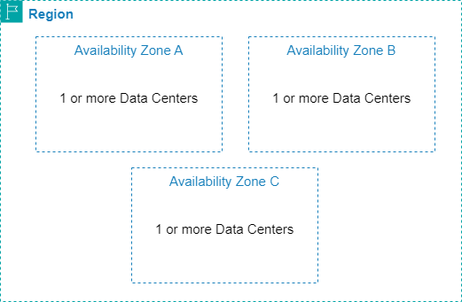
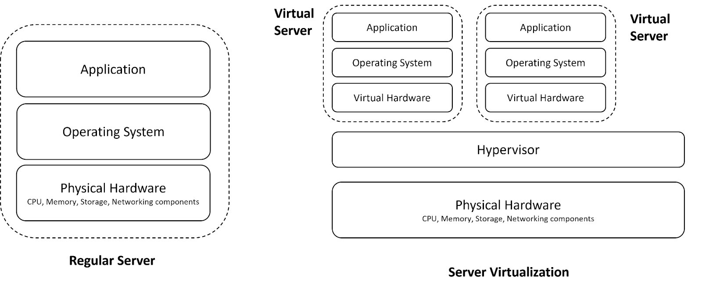
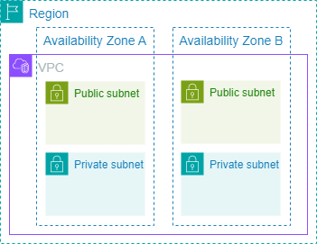

# 01-week

## 1. AWS Regions and Availability Zones

### AWS Regions

AWS hosts its data centers across many geographical areas known as regions. At the time of the creation of this course, AWS has 34 launched regions around the world. Each dot  on this map represents a region, which contains a cluster of data centers spread across the geographical area.

Each AWS region is assigned a geographical name and a region code. The geographical name reflects the region's location. For example, in the United States, there is a region in Northern Virginia called the Northern Virginia Region (N. Virginia). This region has the code us-east-1 meaning it was the first one created in the eastern US.

AWS regions are independent from one another, meaning your data is not replicated from one region to another without your authorization.

To host your applications or data pipelines, you need to choose an AWS region. Consider these four main factors:

+ Latency: choose a region close to where your end users are located to minimize latency;
+ Cost: the resource costs may differ between regions;
+ Compliance: certain regulations may require hosting your data in a specific geographic region;
+ Service availability: not all services are available in all regions.

### Availability Zones (AZs)

In each region, data centers are spread out into availability zones. Each region contains at least 3 isolated and physically separated availability zones. From Amazon's documentation about their global infrastructure: “AZs are physically separated by a meaningful distance, many kilometers, from any other AZ, although all are within 100 km (60 miles) of each other”(1).

Each availability zone contains a group of one or more discrete data centers with redundant power, networking, and physical security. All AZs in an AWS Region are interconnected with high-speed low-latency links.

AZs are assigned a code name. The code name consists of the region code followed by a letter. For example, us-east-1a represents an availability zone in us-east-1 (Northern Virginia Region).

The main purpose of having more than one availability zone within a region is to allow you to host your applications and data resources in multiple AZs for high availability and fault-tolerance. If one availability zone becomes unavailable due to power outage or natural disaster, your work will not be impacted.

### References

+ [Regions and Availability zones](https://aws.amazon.com/about-aws/global-infrastructure/regions_az/)
+ [AWS Global Infrastructure](https://aws.amazon.com/about-aws/global-infrastructure/)

## 2. Compute - Amazon Elastic Compute Cloud (EC2)

One of the basic services provided on the cloud is compute service, which means that AWS provides you with the compute resources needed to run your applications. An example of a compute service is Amazon EC2 (Elastic Compute Cloud), which represents a virtual server or virtual machine (the two terms are used interchangeably). 

### What is a server? How is a virtual server different from a regular server?

A server is like a computer or a set of computers that hosts and runs your applications. It consists of physical hardware (CPU, RAM, storage, networking components), an operating system installed on top of the hardware, and finally the applications that run on top of the operating system. 

When you run your application on the cloud, your application doesn't interact directly with the actual hardware. Instead, it interacts with virtual hardware, which is a software representation of the actual hardware that can emulate its behavior. So on top of the virtual hardware, an operating system can be installed to run your application. The virtual hardware, operating system and application are known as the components of a virtual machine or virtual server (a software representation or emulation of an actual server). 

The benefit of this virtualization or abstraction is that you can create more than one virtual machine that shares the same underlying physical resources. This helps achieve efficient and cost-effective use of resources. The sharing of these resources is done through a software component called the hypervisor, which enables the sharing of the underlying hardware. The hypervisor distributes the underlying physical computing resources, such as CPU and memory, to individual virtual machines as required. 

### Amazon EC2

In AWS, these virtual machines or virtual servers are called Amazon Elastic Compute Cloud or Amazon EC2. EC2 is one of the primary building blocks that you may directly use to run your applications or indirectly use by interacting with other services built on top of EC2 instances.

“Elastic” in EC2 means that you can acquire the necessary compute and memory resources that you need for your work. When you run your applications on EC2 instances, you can configure as many instances as you need, and you only pay for what you use. When you no longer need an instance, you can stop or terminate it. You can also pick the size of an EC2 instance, where size corresponds to the amount of compute, memory, and network capabilities for a given instance. It’s easy to resize based on your needs. 

EC2 instances are grouped into several types, such as general purpose, compute optimized, memory optimized, storage optimized, and accelerated computing, which you can choose based on your use case. 

AWS uses a specific naming convention for the instance types. For example, t3a.micro breaks down as follows:

+ t: family name
+ 3: generation
+ a: optional capabilities
+ micro: size

AWS offers a few different pay-as-you-go purchasing options for EC2 instances. By default, you can choose to set up and launch on-demand EC2 instances that give you compute capacity with no long-term commitments. If you want to save on cost, you can opt for EC2 spot instances, which are unused EC2 computing resources in the AWS cloud available at a discount compared to on-demand prices.

### References

+ [Hardware virtualization](https://www.techtarget.com/searchitoperations/definition/hardware-virtualization)
+ [Virtual servers vs physical servers](https://www.techtarget.com/searchitoperations/tip/Virtual-servers-vs-physical-servers-What-are-the-differences)
+ [Physical servers vs. Virtual machines](https://www.veeam.com/blog/why-virtual-machine-backups-different.html)
+ [What is hypervisor?](https://aws.amazon.com/what-is/hypervisor/)
+ [What is virtualization?](https://aws.amazon.com/what-is/virtualization/)
+ [Traditional virtualization primer](https://docs.aws.amazon.com/whitepapers/latest/security-design-of-aws-nitro-system/traditional-virtualization-primer.html)
+ [What is amazon EC2?](https://docs.aws.amazon.com/AWSEC2/latest/UserGuide/concepts.html)
+ [Amazon EC2 instance types](https://aws.amazon.com/ec2/instance-types/)
+ [Instance type naming conventions](https://docs.aws.amazon.com/ec2/latest/instancetypes/instance-type-names.html)
+ [EC2 instance purchasing options](https://docs.aws.amazon.com/AWSEC2/latest/UserGuide/instance-purchasing-options.html)

## 3. Networking - Virtual Private Cloud (VPC) & Subnets

Networking is another building block for hosting your work on the cloud.

### What is a network? 

A network is simply a collection of devices connected together, where each connection can be a request sent from one device to another or a response to a request. When you create and use resources on AWS, you want these resources to communicate with each other and possibly with the outside internet. Enabling the communication between resources and with the outside world requires an understanding of some basic cloud networking concepts. This includes understanding what an IP address is and how to create a network for your resources on AWS using VPC (Virtual Private Cloud) and subnets.

### What is an IP address?

In a given network, each device is assigned an IP (Internet Protocol) address, which is a series of digits that uniquely identifies each device within the network. These addresses ensure that responses and requests are sent to the correct device. 

There are many types of IP addresses. IPv4 is the most widely integrated version of the IP address system. An IPv4 address is a 32-bit integer expressed in the form x.x.x.x, where each x is an 8-bit number that can take a value between 0 and 255. For example, 192.101.0.2 is a valid IPv4 address.

Another related term you will encounter when working on the cloud is CIDR (Classless Inter-Domain Routing) notation. A CIDR notation represents a range of IP addresses that could be assigned to devices within a particular network. CIDR is used to provision the required number of IP addresses for a particular network and reduce wastage of IP addresses. The following is an example of CIDR notation:

192.101.0.0/24

This notation means that the first 24 bits are fixed and the last 8 bits can be any bits. In other words, 192.101.0.0/24 represents all IP addresses between 192.101.0.0 and 192.101.0.255.

### What is a VPC?

A VPC (Virtual Private Cloud) is an isolated private network where you can launch your AWS resources. A VPC exists inside a region, which can contain more than one VPC, and a VPC spans multiple availability zones inside the region. VPC is a way to isolate your resources (for example EC2) from the outside world. Think of it as a box or a wall that protects and organizes your resources. Resources within the same VPC can communicate with each other. By default, there’s no communication between resources from different VPCs or with the internet unless you allow it to happen by properly configuring the VPC.  

When you create a VPC, you need to specify the range of IP addresses or the CIDR block for the network, which determines the size of the network. Each resource created inside the VPC will be assigned an IP address from the specified range. When you launch resources such as EC2, you need to make sure they’re launched inside a VPC.

### What is a subnet?

Inside your VPC, you may need some resources to be public and others to be private. You can achieve this by creating subnets within your VPC. Subnets provide you with more detailed control over access to your resources. Each VPC consists of subnets created inside availability zones. You can create a public subnet if you want to allow for outside traffic to access your resources, and you can create a private subnet if you don’t want to allow for outside traffic to access your resources.

You can think of a subnet as a smaller network inside your base network. Each subnet is assigned a CIDR block, which must be a subset of the VPC CIDR block. Resources in multiple subnets of the same VPC can communicate because they are part of the same VPC.  

You will learn more about cloud networking concepts in later courses.

### References

+ [What is IPv4?](https://www.whatismyip.com/ipv4/)
+ [What is my IP?](https://www.whatismyip.com/)
+ [What is CIDR?](https://aws.amazon.com/what-is/cidr/)
+ [What is Amazon VPC?](https://docs.aws.amazon.com/vpc/latest/userguide/what-is-amazon-vpc.html)

## 4. Security - AWS Shared Responsibility Model

When you host your applications and resources in the cloud, you’re offloading the heavy duty of managing the physical hardware to the cloud provider. The security of the physical facility is the responsibility of the cloud provider. However, you still own your data in AWS and you have complete control of it, so you are responsible for managing its security. This is known as the shared responsibility model on AWS.

+ AWS is responsible for security of the cloud: this means AWS is responsible for maintaining, protecting, and securing the physical facilities that contain the compute, storage, and networking equipment. It is also responsible for protecting the global infrastructure -- the cables that connect the regions, as well as the software and hardware that run AWS services.
+ You are responsible for security in the cloud: this means you’re responsible for protecting the data, ensuring it’s secured whether it is at rest or in transit, and managing who can access the data and for how long. Depending on the type of AWS services you choose, you might be responsible for additional configurations. 

It’s essential to keep this principle in mind because it’s your responsibility to manage who has access to the data you’re storing in cloud storage systems, and who has access to any pipeline you’re designing on the cloud.

### References

+ [AWS shared responsibility model](https://aws.amazon.com/compliance/shared-responsibility-model/)
+ [Understanding the security scope](https://docs.aws.amazon.com/prescriptive-guidance/latest/strategy-accelerating-security-maturity/understanding-the-security-scope.html)
