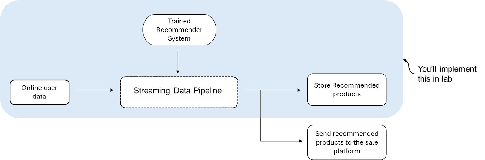

# 04-week

## AWS Services to Meet Your Requirements

In the previous two videos, Morgan walked you through some of the common AWS services that you can use when implementing batch and streaming pipelines. Feel free to also check out the following links to learn more about some of these AWS services.

**AWS Service Options for Batch Pipelines**:

+ AWS Glue ETL: [features](https://aws.amazon.com/glue/features/)
+ Amazon EMR: you can quickly check the overview [here](https://aws.amazon.com/emr/?nc=sn&loc=1) and the first part in [features](https://aws.amazon.com/emr/features/?nc=sn&loc=2&dn=1)
+ Amazon S3: you can quickly check the overview [here](https://aws.amazon.com/s3/)
+ AWS Redshift: you can check the first three sections [here](https://www.cloudzero.com/blog/aws-redshift/)

**AWS Service Options for Streaming Pipelines**:

In the lab this week, you will only focus on implementing the part of the streaming pipeline that stores the recommended products. 

Feel free to check out the following links to learn more about AWS services that you might choose to implement in your streaming pipeline:

+ Amazon Kinesis Data Streams: check the quick overview [here](https://aws.amazon.com/kinesis/data-streams/?nc=sn&loc=1) and the features [here](https://aws.amazon.com/kinesis/data-streams/features/?nc=sn&loc=2)
+ Amazon Data Firehose: check the quick overview [here](https://aws.amazon.com/kinesis/data-firehose/?nc=sn&loc=2&dn=3) and the features [here](https://aws.amazon.com/kinesis/data-firehose/features/?nc=sn&loc=2)
+ Amazon MSK (Management Streaming for Apache Kafka): check the quick overview [here](https://aws.amazon.com/msk/) and the [features](https://aws.amazon.com/msk/features/) (the first paragraph is enough)

**Additional readings**:

+ [A guide to choosing the right AWS streaming service: Kinesis VS MSK](https://medium.com/slalom-build/a-guide-to-choosing-the-right-streaming-solution-for-you-on-aws-57089f03e034)
+ [Streaming data on AWS: Amazon Kinesis Data Streams or AWS MSK?](https://programmaticponderings.com/2023/04/23/streaming-data-on-aws-amazon-kinesis-data-streams-or-amazon-msk/)
