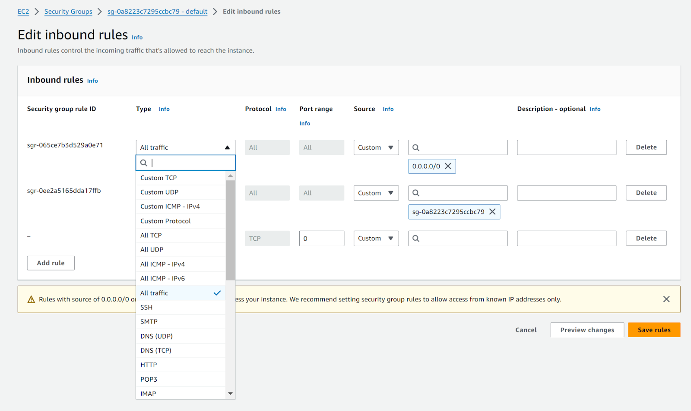

# 01-week

## Basics of AWS IAM

### What is IAM?

AWS IAM is a web service that helps you manage and securely control access to your AWS resources and services. With IAM, you can centrally manage who is authenticated in your Account and what resource permissions they have. Using IAM, you can share your resources without sharing your credentials, and you can select specific actions people can access at a granular level. It’s a global service available at no additional cost, meaning you can see and use your IAM configurations from any region in the AWS Management Console.

### What is an IAM user?

When you create an account on AWS, you begin with the “root user” identity, which has full access to all AWS resources and services in the account. It is strongly recommended that you don’t perform daily operations using this account. Instead, create an admin user for everyday tasks. Whether you’re the root or admin user, you can create other users in your account to allow people in your organization to access AWS resources.

IAM users are created under your AWS account, so you don't need separate accounts for IAM users. Each user could be a person or service that interacts with AWS resources. When you create a user, you define what resources the IAM user can access, and what actions they can perform. AWS will then generate a set of credentials for that user. The credentials could be a username and password for accessing the AWS management console, or they it be an access keys for programmatic access to AWS resources. IAM user credentials are long-term credentials as they stay with the user until the admin rotates them. When you provide users with their own login credentials, you help prevent the sharing of credentials. You can add more users to your account, and all user activities are billed to your account.

By default, a new user does not have any permission to access any AWS resources. You can grant them access to AWS resources by attaching policies to them. A policy specifies what actions are allowed or denied for a given resource (read only, write only, full access). A policy can be attached to multiple users, and a user can have multiple policies. You can choose AWS-managed policies or create your own custom policies. Whenever a user makes a request, AWS evaluates their policies to determine if that request is allowed.

For example, suppose you’re working with a data scientist and want to grant them read-only access to an S3 bucket to extract the training data set. The figures below show the steps to create this user.

1. Create a new user

2. Create the credentials for this user

3. Set the permissions for this user by attaching an existing policy or creating a new one. (For more information, see the **What is an IAM policy?** section below)

4. Review the user details and create the new IAM user

5. Share the login credentials with the user

### What is an IAM group?

Now, what if you want to grant the same permissions to more than one user, maybe a team of data scientists who want to access the same resources with the same level of permissions? You could attach the same policy to each user, but it might be hard to manage as the team grows. In this case, you can create an IAM group, which is a collection of users, and then attach the policy to the group rather than individual users. Each user in the group inherits the group's permissions. Think of the IAM group as a way to organize permissions. Here are some features of IAM groups:

+ Groups can have multiple users
+ A user can belong to no group, one group, or multiple groups (up to 10 groups)
+ Groups cannot be nested

### What is an IAM role?

The third IAM identity is a role. An IAM role has specific permissions with short-term credentials. Roles can be assumed by entities, like people, applications, or trusted AWS resources. IAM roles don't have long-term credentials. Instead, they provide temporary security credentials for the duration of the role session. You first create an IAM role and attach a policy to it. Then you specify which resource can assume this role. This temporarily grants permissions to AWS resources.

**Example 1:** Let’s say you run a code on an EC2 instance that needs to read from S3. By default, the EC2 instance does not have permission to read from S3. You can transfer your credentials to EC2, but this is not secure. A better approach is to create a role, attach the required policy to read from S3, and allow the EC2 instance to assume this role.

**Example 2:** Let’s say you run a Glue ETL job and want it to write the ingested and transformed data to S3. You can create a role with permissions to write to S3, then allow Glue ETL to assume this role.

### What is an IAM Policy?

You can manage access in AWS by creating policies and attaching them to IAM users, groups, or roles.

“A policy is an object in AWS that defines the permissions of the attached user or role. AWS evaluates these policies when an IAM user or role makes a request. Permissions in the policies determine whether the request is allowed or denied. Most policies are stored in AWS as JSON documents.” - [AWS IAM documentation](https://docs.aws.amazon.com/IAM/latest/UserGuide/access_policies.html)

You can use an AWS-managed policy or create your own custom policy.

#### Example: AWS-managed policy (AmazonS3FullAccess)

Here's the AmazonS3FullAccess managed policy that grants full access to S3.

+ **Version** – Specify the version of the policy language that you want to use.
+ **Statement** – Use this element as a container for the details of some given permissions or denials. You can include more than one statement in a policy. If a policy includes multiple statements, AWS applies a logical OR across the statements when evaluating them.
  + **Sid** (Optional) – Include a statement ID to differentiate between your statements.
  + **Effect** – Use Allow or Deny to indicate whether the policy allows or denies access.
  + **Action** – Include a list of actions the policy allows or denies. In this example, the allowed actions on S3 are “*”, meaning all read and write actions on s3 are allowed).
  + Resource – An object or a list of objects to which the actions apply. For example, in the case of S3, you can specify which bucket is allowed or denied access. In this example, the resource element is "*", meaning all resources.

#### Example: Customer managed policy

Here’s another example of a policy that allows read and write access to all S3 buckets, except the bucket “confidential”, where deletion is denied.

### Learn more

+ [Sample S3 bucket policies](https://docs.aws.amazon.com/AmazonS3/latest/userguide/example-bucket-policies.html)
+ [IAM User Guide](https://docs.aws.amazon.com/IAM/latest/UserGuide/access.html) (Access management for AWS resources)
+ [What is IAM?](https://docs.aws.amazon.com/IAM/latest/UserGuide/id.html)

## AWS Networking Overview- VPC

### VPC

A VPC (Virtual Private Cloud) is an isolated private network where you can launch your AWS resources. A VPC exists inside a region and can span multiple availability zones. A region can contain multiple VPCs: each region comes with a preconfigured VPC, known as the default VPC, that you can use to launch your resources, or you can create your own custom VPC within the same region.

Launching resources such as EC2 instances or RDS databases within a VPC enables them to interact with other resources in the VPC. However, a custom VPC, by default, does not allow communication with the public internet or other VPCs. You can configure the VPC settings to allow connectivity between VPCs or between a VPC and the internet. Note that AWS provides a default VPC, which is already set up for public internet access.

#### Learn more

For more information about the default VPC and how to create your custom VPC, see the [AWS documentation](https://docs.aws.amazon.com/vpc/latest/userguide/default-vpc.html).

### Internet Gateway

An internet gateway enables resources created inside a public subnet to send and receive traffic from the public internet. It allows both inbound and outbound traffic, connecting resources within a public subnet to the internet and allowing outside resources to connect to your resources. You can attach only one internet gateway to each VPC. That's because behind the scenes, the internet gateway cloud service is supported by a distributed infrastructure, with built-in redundancy and high availability. AWS will also automatically scale the gateway's capacity up or down to handle varying loads of traffic.

Note that resources that are created within a public subnet should have two types of IP addresses: one private IP address used to communicate with resources within the same VPC and another public IP address that allows outside resources to connect to them. You would need to enable each resource in a public subnet to have a public address.

### NAT Gateway

Resources in a private subnet are hidden from the internet, preventing outside connections and protecting them from attacks and unauthorized access (unsolicited connection requests are not allowed). However, resources in a private subnet can establish a one-way connection to the internet for outgoing requests (e.g., to download an update or send an email). You can enable this one-way connection by using a NAT gateway (Network Address Translation service). You  launch a NAT gateway inside a public subnet and then the NAT gateway can work with the internet gateway to allow resources in a private subnet to connect to the internet. When a private resource sends an outgoing request, the NAT gateway replaces the resource's private address with its own address. To send the response traffic to the private resource, the NAT gateway translates the address back to the original source address. NAT gateways are not available in the free-tier AWS account.

#### Learn more

+ [Internet Gateway](https://docs.aws.amazon.com/vpc/latest/userguide/VPC_Internet_Gateway.html)
+ [NAT Devices](https://docs.aws.amazon.com/vpc/latest/userguide/vpc-nat.html)

### Route Table

Each time a resource within a subnet generates a request, that request will contain the IP address of the destination that it wants to reach. The request needs additional direction to know where to go. For example, does it need to stay in the local network or should it go through a gateway? All of this additional information can be expressed as a set of rules, called routes, that determine where network traffic from your subnet is directed. These routes are stored in a route table. So you can think of a route table as a collection of street signs that direct the traffic generated from a subnet to reach its destination.

When you create a VPC, a route table called the main route table is automatically created. This table assumes that traffic should flow between the resources within the same VPC, so by default it contains a route that directs any traffic with a destination IP address within the VPC CIDR block to the local network. In addition to the main route table, you can create custom route tables for the same VPC and associate them with particular subnets. A common practice is to create at least two route tables: one that you associate with public subnets and another one that you associate with private subnets. By default, any custom table that you create will have the local route already inside it, and you can add additional routes to it. If a subnet is not associated with any custom route tables, it uses the main route table. Here's an example:

In this example, each subnet is associated with a different route table. The destination column represents the destination IP address to which a request is sent, and the target column represents how or through what component the traffic should be routed. In route table 1 that's associated with the public subnet, the first row means that any traffic sent to an IP address within 10.0.0.0/16, which is the VPC CIDR block, is routed inside the local VPC. Otherwise, if the IP address does not match any address within 10.0.0.0/16, it is routed to the internet gateway.

#### Learn more

+ [Route Table](https://docs.aws.amazon.com/vpc/latest/userguide/VPC_Route_Tables.html)

### Network ACL

You can protect your resources from unauthorized access by choosing private subnets and ensuring proper routing. To add additional security to your subnets, you can also set up a firewall that filters traffic to and from your subnets; this is done by using network ACLs (access control lists) to explicitly mention what traffic is allowed to enter or leave a subnet. A network ACL consists of a list of rules that specify which inbound or outgoing traffic is allowed or denied. It is created at the VPC level and can be associated with specific subnets. When you create a VPC, a default network ACL is automatically created. You can add custom inbound and outbound rules to this network ACL or even create your own custom network ACLs and associate them with specific subnets. Network ACLs help control the flow of traffic within a VPC between subnets as well as to/from the public internet.

#### Here's what the default network ACL looks like

##### Inbound Rules

| Rule # | Type             | Protocol | Port range | Source    | Allow/Deny |
|--------|------------------|----------|------------|-----------|------------|
| 100    | All IPv4 traffic | All      | All        | 0.0.0.0/0 | ALLOW      |
| *      | All IPv4 traffic | All      | All        | 0.0.0.0/0 | DENY       |

##### Outbound Rules

| Rule # | Type             | Protocol | Port range | Source    | Allow/Deny |
|--------|------------------|----------|------------|-----------|------------|
| 100    | All IPv4 traffic | All      | All        | 0.0.0.0/0 | ALLOW      |
| *      | All IPv4 traffic | All      | All        | 0.0.0.0/0 | DENY       |

It is configured to allow all incoming traffic to flow into the subnets, and all outgoing traffic to flow out of the subnets. The last rule whose rule number is an asterisk (*) is always included in any network ACL: it ensures that if a request doesn't match any of the other numbered rules, it's denied. You can't modify or remove this rule.

#### Here's an example of a custom network ACL

Rules are evaluated in ascending order according to the rule number until a match is found. If no match is found then the final rule (*) is applied.

### Security Groups

While a network ACL acts as a firewall that filters traffic to and from your subnets, a security group acts as a firewall for a specific EC2 instance to control incoming and outgoing traffic for that specific instance. It adds an additional layer of security for any of your resources that run on your EC2 instances, and allows you to specify inbound rules (to control incoming traffic to your instance) and outbound rules (to control outbound traffic from your instance).

+ [Reference](https://docs.aws.amazon.com/vpc/latest/userguide/infrastructure-security.html#VPC_Security_Comparison)

By default, all outbound traffic from your instance is allowed and all in-bound traffic to your instance is denied. When you create an EC2 instance or after you launch it, you can modify the in-bound rules to allow certain types of traffic from certain IP addresses at certain ports. Here's an example of some inbound rules that can be edited from the AWS management console.

When you create an inbound rule, you must specify the following:

+ The protocol (e.g. SSH, HTTP, HTTPs, etc.), which defines the type of traffic allowed. For more info about these protocols, you can check [here](https://www.cdw.com/content/cdw/en/articles/networking/types-of-network-protocols.html).
+ The range of ports to allow (depending on the protocol, the port number can be automatically assigned). For more info about port numbers, you can check [here](https://www.cloudflare.com/learning/network-layer/what-is-a-computer-port/).
+ The traffic source to allow for inbound rules (the IP address of the source).

#### Learn more

+ [Control traffic to subnets using network ACLs](https://docs.aws.amazon.com/vpc/latest/userguide/vpc-network-acls.html)
+ [Create a security group](https://docs.aws.amazon.com/en_us/console/ec2/security-groups/create)
+ [Security group rules](https://docs.aws.amazon.com/en_us/console/ec2/security-groups/reference)

### Endpoints

There are two types of AWS services: private zone services and public zone services.

+ Private zone services offer resources that need to be launched within a VPC. These services include Amazon EC2, RDS (Relational Database Service), ELB (Elastic Load Balancer), and EFS (Elastic File System).
+ Public zone services offer resources that do not need to be launched within a VPC. Instead, these resources are accessed using public endpoints (i.e. public IP addresses). These services include Amazon S3, Amazon DynamoDB, AWS Lambda, Amazon Kinesis, and Amazon Athena.

You can use an internet gateway and NAT gateway to allow resources in  the subnets to access public services, just as they connect to the public internet. But what if you want these resources to **only** connect to AWS public services? You can still use gateways, but AWS offers another option: endpoints.

+ Interface endpoints can be placed in a public subnet or private subnet to allow resources in these subnets to connect to AWS public resources.
+ Gateway endpoints can be attached to a VPC to allow the resources in the VPC to connect to S3 and DynamoDB. (S3 can also be reached using an interface endpoint, but DynamoDB can only be reached using gateway endpoint).

#### Learn more

+ [What are VPC endpoints?](https://docs.aws.amazon.com/whitepapers/latest/aws-privatelink/what-are-vpc-endpoints.html)

### Final Remark

In these reading materials, we mentioned how resources can connect to the public internet or public resources. But we did not mention how two VPCs can communicate with each other. To learn more about this topic, you can read about [VPC peering](https://docs.aws.amazon.com/vpc/latest/peering/what-is-vpc-peering.html).
