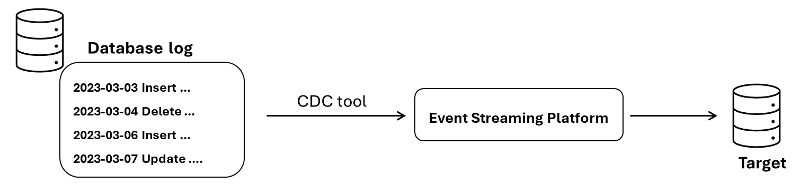

# 02-week

## Batch and Streaming Tools

In the labs in course 1, you used AWS Glue ETL as a batch ingestion tool to extract data from a relational database. You also learned about AWS Kinesis Data Streams and how it could be used as a streaming ingestion tool. Let’s explore other ingestion tools and compare batch and streaming use cases.

### Batch Ingestion Tools

+ Popular AWS Tools:
  + AWS Glue ETL: this service enables you to ingest data from various sources (such as Amazon RDS, Amazon S3, Amazon Redshift, Amazon DynamoDB, and [others](https://docs.aws.amazon.com/glue/latest/dg/glue-connections.html)), transforming it and then loading it into a destination. It performs an ETL job using Apache Spark (distributed processing engine) to distribute the transformation workloads across computing nodes. AWS Glue provides a serverless environment where you can create code-based solutions for both data ingestion and transformation. To learn more about the AWS Glue environment, see [AWS Glue Components](https://docs.aws.amazon.com/glue/latest/dg/components-key-concepts.html) and [AWS Glue ETL guidance](https://docs.aws.amazon.com/prescriptive-guidance/latest/serverless-etl-aws-glue/aws-glue-etl.html).
  + Amazon EMR: Amazon EMR is a managed cluster platform that provides a simple way to run big data frameworks such as [Apache Hadoop](https://aws.amazon.com/elasticmapreduce/details/hadoop) and [Apache Spark](https://aws.amazon.com/elasticmapreduce/details/spark). These tools are useful for ingesting vast amounts of data from a database (petabyte-scale), transforming them at scale, and loading them into AWS data stores and databases. Amazon EMR can run in a serverless mode or in a provisioned mode where you specify the computing resources that are needed for your workload. To learn more about the details of Amazon EMR, you can read the [AWS documentation](https://docs.aws.amazon.com/emr/latest/ManagementGuide/emr-what-is-emr.html).
  _**What is the difference between AWS Glue ETL and Amazon EMR?**_  Both services can be used to perform big data processing using the Apache Spark engine, but they differ in terms of the amount of management and configuration that you need to perform, as well as cost. AWS Glue requires less configuration and is typically more convenient. On the other hand, Amazon EMR provides more control over the computing and memory resources but requires more configuration knowledge. You will learn more about the distributed framework in the upcoming courses of this specialization.
  + AWS DMS: AWS Glue ETL and Amazon EMR are both tools that enable you to perform transformations at scale while ingesting data. If you don’t need to perform transformations while ingesting data, you can consider using AWS DMS (Data Migration Service). This service allows you to sync data from an existing database (on-premises or hosted on the AWS cloud) to another data store that exists within your data pipeline (such as Amazon S3 or a data warehouse). You can also use this service to migrate data from one database engine to a different database engine. It is available in serverless or provisioned modes. To learn more about this service, check out [the overview page of this service](https://aws.amazon.com/dms/).
+ Other AWS ingesting services:
  + [AWS Snow family](https://aws.amazon.com/snow/): if your company wants to migrate its legacy on-premise system to the cloud, you might need to transfer massive amounts of data, sometimes 100 TB or more. It would be very slow and costly to migrate this data over the internet, so you might want to consider a transfer appliance instead. At the time of creation for these courses, AWS offers transfer appliances called Snowball and Snowcone that help you move data in and out of the AWS cloud.
  + [AWS Transfer family](https://aws.amazon.com/aws-transfer-family/): This is a service that enables you to transfer files into and out of Amazon S3 using common file transfer protocols such as SFTP and FTP protocols.
+ Other non-AWS ingestion tools:
  There are other ingestion tools provided by other vendors or open-source projects that allow you to set a target and source (could be from different cloud providers) and ingest data in various ways. These tools are known as connectors because they allow you to connect a particular source to a target system. Examples of such tools include: [Airbyte](https://airbyte.com/), [Matillion](https://www.matillion.com/support) and [Fivetran](https://www.fivetran.com/?r=0).

### Streaming Ingestion Tools

+ In course 1, you read about two streaming platforms: Amazon Kinesis Data Streams and Amazon Managed Streaming for Apache Kafka (MSK). To quickly refresh your memory about those services, you can check the overview service page of each ([Kinesis](https://aws.amazon.com/kinesis/data-streams/) and [MSK](https://aws.amazon.com/msk/)). Later this week, we’ll get into more detail about these streaming platforms.

### Key Considerations for Batch vs Streaming Ingestion

+ **Use cases:** Ask your stakeholders: "if you get data in real time, what actions can you perform that would be an improvement to getting the data periodically in batches?"
  + Machine learning: batch is an excellent approach for many common use cases, such as model training. Consider if stakeholders can benefit from continuous training and online prediction.
  + Dashboards/Reporting: What are the benefits of having a real-time dashboard over one that is updated daily or weekly? Consider how stakeholders will act on real-time data.
+ **Latency:** Do you need millisecond real-time data ingestion? Or would a micro-batch approach work, accumulating and ingesting data, say, every minute?
+ **Cost:** A streaming ingestion approach is typically not as straightforward as batch ingestion, and it can carry extra costs and complexities.
  + Will your streaming-first approach cost more in terms of time, money, maintenance, downtime, and opportunity cost than simply doing batch?
  + If you're using a streaming platform: does your team have the capability to manage it? Do you have the skills to fix errors propagating in an event system?
+ **Existing/Available system:**
  + Destination system: If you ingest data in real time, can downstream storage systems handle the rate of data flow?
  + Source system: Are you getting data from a live production instance? If so, what’s the impact of your ingestion process on this source system?  Streaming systems are the best fit for many data source types. For instance, in IoT applications, each sensor writes events or measurements to streaming systems as they happen. While you can connect to the streaming source to directly write data into a database, you might find that it is a better fit to use a streaming ingestion platform such as Amazon Kinesis or Apache Kafka.
+ **Reliability/Availability:** Are your streaming pipeline and system reliable and redundant if infrastructure fails? Streaming services require high availability of compute resources. On the other hand, batch services don't need high availability. 

I suggest you adopt true real-time streaming only after identifying a business use case that justifies the trade-offs against using batch. 

**Note:** There are other use cases where you might need to perform both types of ingestions (same computations done on batch and streaming). For that, you can use ingestion frameworks, such as the lambda architecture discussed in the previous course,  to handle both batch and streaming ingestion patterns.

## Summary of the Differences: ETL vs. ELT

| **Aspect**                   | **ETL**                                                                                                                                              | **ELT**                                                                                                                                                      |
|------------------------------|------------------------------------------------------------------------------------------------------------------------------------------------------|-------------------------------------------------------------------------------------------------------------------------------------------------------------|
| **History**                  | - In the 80’s and 90’s, data warehouse cost was very expensive (millions of dollars), so engineers wanted to be very intentional about the data they were about to load into the data warehouse.   - Data volume was still manageable. | - Cloud data warehouse reduced the cost of storing and processing data significantly (from millions of dollars to hundreds/thousands of dollars only).  - Data volume exploded. |
| **Processing (transformation)** | - Data is transformed into a predetermined format before it is loaded into a data repository. So, data engineers have to carefully model the data and transform it into this format.  - Transformations rely on the processing power of the processing tool that is used to ingest data (unrelated to the target destination). | - Raw data is loaded into the target destination. Then it is transformed just before analytics (can be used with not well-defined data requests).  - Transformations rely on the processing power of the data repository, such as the data warehouse. |
| **Maintenance time**         | If the transformation is found to be inadequate, data needs to be re-loaded.                                                                        | The original data is intact and already loaded and can be used when necessary for additional transformation: less time required for data maintenance.         |
| **Load Time & transformation time** | Load time: it typically takes longer as it uses a staging area and system.  Transformation time: it depends on the data size, the transformation complexity, and the tool that is used to perform the transformation. | Load time: there is no transformation involved, the data is directly loaded into the destination system.  Transformation time: it is typically faster because it relies on the processing power and parallelization of modern data warehouse (generally considered more efficient). |
| **Flexibility (data types)** | ETLs are typically designed to handle structured data.                                                                                               | ELT can handle all types of data: structured, unstructured, semi-structured. Once the data is loaded into the target system, you can transform it.            |
| **Cost**                     | It depends on what ETL/ELT tool is used and to what target system the data is loaded. (And of course, it depends on the data volume).                | It depends on what ETL/ELT tool is used and to what target system the data is loaded. (And of course, it depends on the data volume).                         |
| **Scalability**              | Nowadays, most of the cloud tools are scalable. However, the challenge here is that if you have lots of data sources and lots of targets, you would need to put in lots of effort to manage the code and handle data from multiple sources. | ELT uses the scalable processing power of the data warehouse to enable transformation on a large scale.                                                      |
| **Data quality/security**    | It ensures data quality by cleaning it first. Transformations can also include masking personal information.                                        | The data needs to be transferred first to the target system before transformations that enhance data quality or security are applied.   *There’s a sub-pattern called EtLT where small t does not refer to business modeling but to transformation with limited scope (mask sensitive data, deduplicate rows).* |

## What is Change Data Capture (CDC)?

### What is CDC? 

Suppose you extracted and loaded data from a database into your storage system. After some time, you might need to update the data stored in your storage system to ensure that it is in-sync with the data in the source system. There are two strategies for this:

+ Full snapshots or full load:  in this approach, every time you want to update the data stored in your system, you ingest the entire data from your source system, replacing the old stored data with the new updated data. If your data is tabular, fully loading the data means that you delete all the old data from the stored table and extract all rows from the source table every time you need to update your stored data. This is a straight-forward approach that ensures the consistency between the data in the source system and the data stored in your data pipeline. However for high-volume data, it can take a long time to run and it can require lots of processing and memory resources. It is more suitable for cases where there’s no need for frequent data updates.
+ Incremental (differential) load: in this approach, you only load updates and changes since the last read from the source systems. For example, when loading updates from a source database, you might utilize a last_updated_at column to identify the rows of data that have been updated since you last read from this source database, and then only load the updated data from these identified rows. While this approach is faster than the full load approach, especially for high-volume data, it might require more complex logic to implement. When working with databases, this process is known as Change Data Capture or (CDC).  According to the book Fundamentals of Data engineering, “Change data capture (CDC) is a method for extracting each change event (insert, update, delete) that occurs in a database” and making it available for downstream systems.

### Use Cases for CDC

+ CDC helps you synchronize data across different databases, supporting continuous database replication. For example, you might have a source PostgreSQL system that supports an application and you want to periodically or continuously ingest table changes into a data warehouse to enable analytics based on the most recent data. Or if you work in a hybrid company, you might need to use CDC to capture changes in on-premises databases and apply those changes to on-cloud databases.
+ CDC helps you capture every historical change for auditing and other business purposes. For example, certain businesses are required to maintain complete historic information of their customer purchases for regulatory purposes, or to extract insights that allow businesses to improve.
+ CDC enables microservices to track any change in the source database. For example, consider a microservice that manages purchase orders. When a new order is placed, you can use CDC to relay information to shipment service and customer service.

### Two approaches to CDC

+ Push: This approach requires you to implement some sort of logic or process to capture changes in the source database. Then it relies on the source database to push any data updates to the target system when something changes in the source system. This method allows the target systems to be updated with the latest data in near real-time, but if you don't set this up properly, you risk losing data updates if the target systems are unreachable when the source systems try to push the changes.
+ Pull: This approach requires the target systems to continuously poll the source database to check for changes and then pull in data updates when they happen. This method typically results in a lag before the target systems pull in any new data updates because the changes are usually batched between pull requests.

### CDC Implementation Patterns

There are several methods for how CDC can extract changes from databases.

+ **Batch-oriented or query-based CDC (pull-based):** In this approach, you query the database itself to identify if there has been a change in data. In the case of relational databases, this requires that the database has an additional column labeled as updated_at, last_updated or last_modified that helps you find all updated rows past a certain specified time. This process allows you to extract changes and incrementally update a target table. However, this approach can add computational overhead to the source system because target systems have to scan each row in the table to identify the last updated values.
+ **Continuous or log-based CDC (pull-based):** Instead of running periodic queries to get the table changes as a batch, you can treat each update to the database as an event using continuous CDC. This type of CDC relies on checking the database log. A database log records every change to the database sequentially  (e.g., every create, update, delete) and is used in case of a failure to restore the database state. You can read the events from this log (by writing your own code or using a CDC tool such as Debezium) and send them to a streaming platform, such as Apache Kafka. This way, you can capture data changes in real-time without incurring any computational overhead or requiring the need for an extra column in the source databases.
  
+ **Trigger-based CDC (push-based method):** A trigger is a stored function that you can configure to run when a specific column changes. The triggers inform the CDC of the changes in the source databases and in this way it relieves the CDC from detecting changes. However, too many triggers can negatively impact the write performance of the source database.

### Tools for CDC

Feel free to read more about some of the common tools used to implement CDC

+ [Debezium](https://debezium.io/)
+ [AWS DMS](https://docs.aws.amazon.com/dms/latest/userguide/CHAP_Task.CDC.html)
+ [Kafka connect API](https://limadelrey.medium.com/kafka-connect-how-to-create-a-real-time-data-pipeline-using-change-data-capture-cdc-c60e06e5306a)
+ [Airbyte log-based CDC](https://airbyte.com/solutions/database-replication)

## Summary: General Considerations for Choosing Ingestion Tools

When choosing an ingestion tool for your data systems, you should consider the characteristics of the data you're ingesting, as well as the reliability and durability of the ingestion tool.

### Characteristics of the data 

_Note: In the book “Fundamentals of data engineering”, Joe and Matt refer to the characteristics of the data as the data payload, which includes data kind (type and format), shape, size, schema and data types, and metadata._

+ **Data type & structure:** You learned in course 1 that data in source systems could be structured, unstructured, or semi-structured. When deciding how to ingest data and what tool to choose, you need to understand the data type and structure (e.g. an image in PNG format) so that you can identify the appropriate ingestion tool and transformations you might need to apply later on.
+ **Data volume:** For data volume, you need to consider two things:
  + Data size in bytes of the existing data that you need to ingest: In case of batch ingestion, you need to consider the size of the historical data that you need to ingest. Can you ingest the entire historical data in one big chunk? Depending on the network connection between the source system and the target system, it may be possible to transfer the historical data over the network, but if you have limited bandwidth then you may need to split  the massive payload into chunks, which effectively reduces the size of the payload into smaller subsections. In case of streaming ingestion, you need to consider the message size.  You must ensure that the streaming ingestion tool can handle the maximum expected message size. For example, Amazon Kinesis Data Streams supports a maximum message size of 1 MB, while Kafka defaults to this maximum size but can be configured to support a maximum data size of 20 MB or more.
  + The size of the future data that you may ingest with the same pipeline: how are you expecting the data to grow? What is  the daily, monthly, or yearly growth of data?  Considering the actual and future size helps you understand how to configure your tool and what cost to anticipate to ensure that your ingestion system meets the demands.
+ **Latency requirements:** When designing your pipeline, one of the stakeholder requirements that you need to consider is latency: how fast do stakeholders want to operate on data? What is the acceptable delay? Do they need to extract insights from the data one day after it is ingested, or do they need near real time insights? In other words, is it a batch scenario: where data needs to be ingested once a day, a week, a month? Or does the data need to be streamed from a streaming source continuously with the lowest delay possible (for instance, in milli-seconds)? To meet the latency requirement, you need to think about how quickly you need to process the ingested data once it reaches your pipeline and also understand how quickly the source data is generated. The velocity of the data will impact the tools (batch or streaming tools) you choose to ingest and process the data.
+ **Data quality:** Is the source data in good shape for immediate downstream use? What post-processing is required to serve it? Depending on the source systems the data might be incomplete, or contain inconsistent information, duplicates, or errors. If the data is not expected to be in good shape, then you may need to check the quality of the data ingested in order to fix any issues. Some ingestion tools can help you fill in missing values or detect/fix inconsistencies or invalid entries. You’ll learn more about quality checks in the upcoming course.
+ **Changes in schema:** schema changes (e.g. adding a new column, changing a column type, creating a new table, renaming a column) frequently occur in source systems and are generally out of your control. If you’re expecting these changes to happen frequently, then you might need to consider using ingestion tools that automatically detect schema changes. However, communication between you and the upstream stakeholders is as important as the automation that checks for schema changes.

### Reliability and Durability

+ Reliability and durability are two important considerations in the ingestion stage. Reliability means making sure that ingestion systems are performing their intended function properly. Durability means making sure that data isn’t lost or corrupted. If you design a reliable ingestion system, you will ensure the durability of the ingested data. For example, streaming systems such as IoT devices do not retain events indefinitely, so if you don’t correctly ingest its data, the data may be lost. Make sure to understand the characteristics of the source systems and the ingestion tools.

**Advice:** Evaluate the tradeoffs between the cost of losing data vs building an appropriate level of redundancy. For more information and consideration, please check out chapter 7 of Fundamentals of Data Engineering.
