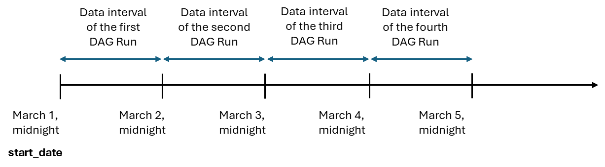
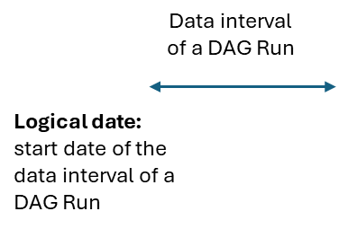
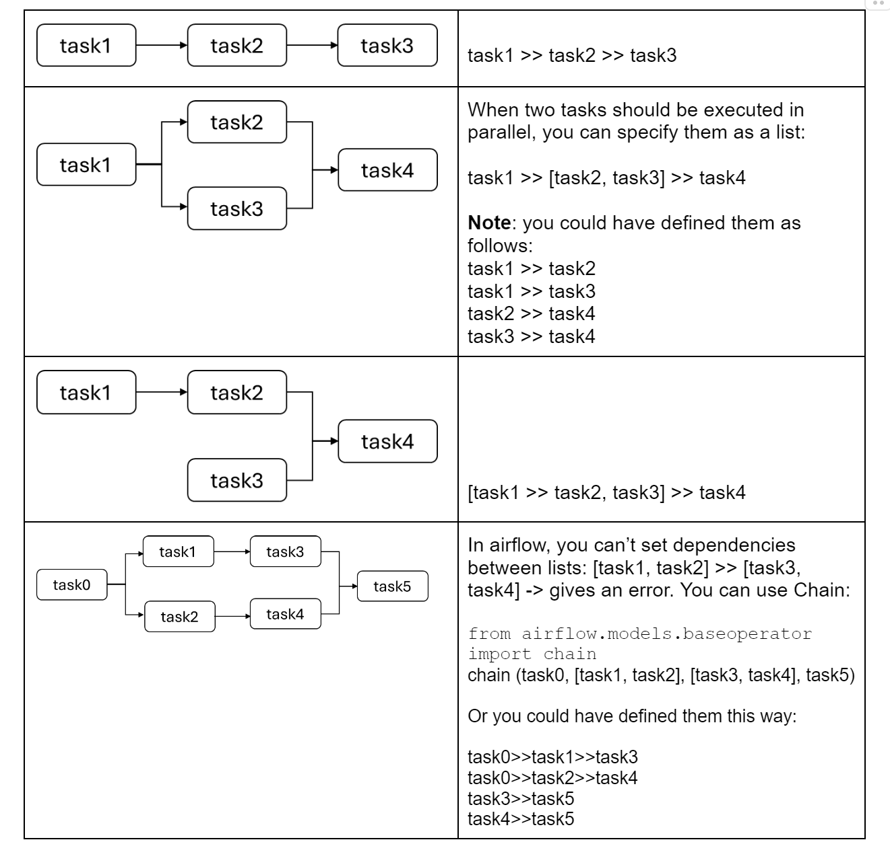

# 04-week

## Additional Notes About Airflow Basic Concepts

This reading item contains additional notes about scheduling in Airflow,  using Airflow Operators and defining dependencies between tasks.

### Scheduling Your DAG & Other DAG Parameters

When instantiating the DAG in the previous video, I specified the following parameters: dag_id, tags, description, schedule, start_date and catchup. You can also specify other DAG parameters. Check out the [Airflow documentation](https://airflow.apache.org/docs/apache-airflow/stable/_api/airflow/models/dag/index.html#airflow.models.dag.DAG) to learn more.

In this reading item, we'll take a closer look at what the start_date parameter does. When you orchestrate your pipeline in Airflow, you may encounter the terms "data interval " and "logical date"  in the Airflow UI or in the Airflow documentation. Each DAG run is associated with a data interval that represents the time range it operates in. Let’s say you instantiated a DAG to run daily using the cron preset `@daily` and the start date is March 1. As shown in the following figure, each DAG run operates in a data interval that starts each day at midnight (00:00) and ends at midnight (24:00).



The “logical date” is a term associated with a specific DAG run, and it denotes the start of the data interval.



The start_date argument for the DAG marks the "logical date" or the start of the first "data interval". 

Given a data interval, the DAG is executed at the end of the data interval, not the beginning. This is because Airflow was developed as a solution for ETL needs, where you typically need to aggregate data collected over a time interval. So if you want to analyze the data for March 1, you would need to wait till March 2 midnight after all data for March 1 becomes available. This is why a DAG is always executed at the end of the data interval, and the logical date of a DAG run (start of the data interval) represents the date for which the DAG run is executed, not when the DAG is actually executed. So the first DAG run will only be scheduled one interval after start_date.

#### Check out these links if you want to learn more about scheduling in Airflow:

+ [Data-interval](https://airflow.apache.org/docs/apache-airflow/stable/core-concepts/dag-run.html#data-interval)
+ [What does execution date mean?](https://airflow.apache.org/docs/apache-airflow/stable/faq.html#what-does-execution-date-mean)
+ You can customize your DAG scheduling using [timetables](https://airflow.apache.org/docs/apache-airflow/stable/authoring-and-scheduling/timetable.html). In addition to scheduling DAGs, you can make your DAG data-aware, meaning that it is triggered when a data object is updated in another task. Here's an [example](https://airflow.apache.org/docs/apache-airflow/stable/authoring-and-scheduling/datasets.html) of this.

### Airflow Operators

You learned about some of the Airflow operators such as EmptyOperator, PythonOperator, BashOperator, EmailOperator. You can learn more about these operators by checking out the [Airflow documentation](https://airflow.apache.org/docs/apache-airflow/stable/_api/airflow/operators/index.html). In addition to those [core operators](https://airflow.apache.org/docs/apache-airflow/stable/operators-and-hooks-ref.html) provided by Airflow, there’s a [list of other operators](https://airflow.apache.org/docs/apache-airflow-providers/operators-and-hooks-ref/index.html) that are released independently of the Airflow core that allows you to connect to external systems. For example, [this link](https://airflow.apache.org/docs/apache-airflow-providers/operators-and-hooks-ref/index.html) shows all the possible operators that you can use to interact with each AWS service, and [this link](https://airflow.apache.org/docs/apache-airflow-providers/operators-and-hooks-ref/software.html#transfers) includes the operators you can use to copy data, for example, from a database to S3. It is generally recommended to use the available operators instead of writing your own code from scratch.

In the previous video, the two parameters that were specified in the PythonOperator were `task_id` and `python_callable`. You can always review the [Airflow documentation](https://airflow.apache.org/docs/apache-airflow/stable/_api/airflow/operators/python/index.html#airflow.operators.python.PythonOperator) to see what other parameters you can specify for PythonOperator. [Here](https://airflow.apache.org/docs/apache-airflow/1.10.13/_api/airflow/operators/index.html#package-contents) is another set of parameters that you can pass to any operators, it includes the following parameters:

+ email (str or list[str]): the ‘to’ email address(es) used in email alerts. 
+ email_on_retry (bool): indicates whether email alerts should be sent when a task is retried
+ email_on_failure (bool): indicates whether email alerts should be sent when a task failed
+ retries (int): the number of retries that should be performed before failing the task

Check out this [link](https://docs.astronomer.io/learn/what-is-a-sensor) if you'd like to learn more about Airflow sensors, another special kind of operator.

### Defining Dependencies

You learned that you can use the bit-shift operator (>>) to specify the dependencies between tasks. Here are some examples:



### Additional References

+ [An introduction to the Airflow UI](https://www.astronomer.io/docs/learn/airflow-ui)

## Best Practices for Writing Airflow DAGs

When writing DAGs, there are some best practices that help ensure your code is efficient, readable, idempotent and reproducible (like with any code). Let’s go through some of these basic practices.

### Keep tasks simple and atomic

When you prepare your pipeline for orchestration, you need to identify the tasks or steps of your pipeline. Keep your tasks simple such that each task represents one operation. You don’t want to end up with one task that does everything, otherwise you'll lose visibility into your data pipeline and reduce the readability of your code, which does not support idempotency.  

For example, in an ETL or ELT process, you would need to create at least three tasks: extract, transform, load, instead of creating just one task that handles the entire process. (For example, check again the DAG of the first lab of this week).

### Avoid top-level code

In the following code,

```python
call_some_function()
perform_computation()
with DAG(dag_id="example_xcom", start_date=datetime(2024, 3, 13), schedule='@daily',catchup=False):
        task_1 = PythonOperator(task_id='extract',python_callable=extract_api)
        task_2 = PythonOperator(task_id='load_data',python_callable=load)
        task_1 >> task_2
```

call_some_function() and perform_computation() are both high-level codes. In general any code that isn’t part of your DAG or operator instantiations is considered to be top-level code. This type of code will be executed at the time when the DAG is parsed by the scheduler. On the other hand, any code that is part of an operator is executed when the task runs, not when the DAG is parsed. Top-level code can cause performance issues because the scheduler checks the DAG directory and parses the DAG files every 30 seconds. So it may not be efficient to execute the high-level code this frequently especially if the code makes some requests to an API or a database.

### Use variables (user-created variables, Airflow [built-in variables and macros](https://airflow.apache.org/docs/apache-airflow/stable/templates-ref.html))

**User-created variables:** Including hard-coded values directly in your code is generally not a good practice in software development. This is because they make your code less readable and more error-prone -- you may need to use the same value in multiple places and updating the same value in multiple places can be error-prone. The same principle also applies to when you write code to define your pipelines. Instead of including hard-coded values within your DAG or task definitions, you can store these values by creating variables in the Airflow UI or creating environmental variables and use these variables dynamically inside your code.

[Recommendations from Airflow documentation regarding using Variables](https://airflow.apache.org/docs/apache-airflow/stable/core-concepts/variables.html): “Variables are global, and should only be used for overall configuration that covers the entire installation; to pass data from one Task/Operator to another, you should use XComs instead. We also recommend that you try to keep most of your settings and configuration in your DAG files, so it can be versioned using source control; Variables are really only for values that are truly runtime-dependent."

**Airflow built-in Variables:** You learned that Airflow has a set of built-in variables that contain information about the currently running DAG and its tasks, such as the logical date of the DAG run and task instance (for a list of such variables, check [here](https://airflow.apache.org/docs/apache-airflow/stable/templates-ref.html)). You learned that you can access these variables within a task function by passing the context dictionary as an argument to the function. You can also pass these variables directly to the PythonOperator using a syntax known as Jinja templating, which looks like this : “{{**ds**}}”. You use double curly brackets and inside the brackets you specify the variable you’d like to access. In this example, ds represents the logical date of the DAG run.

Let’s see an example: Assume that your python_callable is a function that expects the name of a file. For example, this function loads some data to an s3 bucket and requires that you pass the file name.  And let’s say you want to include the logical date in the file_name.

```python
def load_to_s3(file_name):    
    #code that loads data    
    print(file_name)
```

You can specify this information in the PythonOperator as follows:

```python
task_load_s3 = PythonOperator(task_id="load_to_d3",
         python_callable=load_to_s3,
         op_kwargs={'file_name': "data/created{{ds}}/file.csv"})
```

The parameter **op_kwargs** allows you to specify the arguments that you need to pass to the function load_to_s3. Note how the logical date was included in the file name using templating (“{{**ds**}}”).

### Task groups

In the Airflow UI, you can group tasks using Task Groups to organize your DAGs and make them more readable. Inside the task group, you can define tasks and their dependencies using the bit-shift operators <<  and  >>.  You can create a Task Group using the  "with" statement, as shown in the following example.  

```python
from airflow.utils.task_group import TaskGroup  
with DAG(...):     
    start = DummyOperator(...)
    with TaskGroup('task_group')as task_group:
       task_a = PythonOperator(...)
       task_b = PythonOperator(...)
       task_a >> task_b
    end = DummyOperator(...)      
    start >> task_group >> end   
```

### Other practices (Airflow is an orchestrator not an executor)

+ Heavy processing should be assumed by execution frameworks (e.g. Spark) not Airflow
+ For large datasets, don’t use XComs (e.g. to push dataframes). Use intermediary data storage instead.
+ Including code that is not part of your DAG or operator makes your DAG hard to maintain and read: consider keeping any extra code that is needed for your tasks in a separate file.

### Additional References (if you’d like to learn more)

+ [Airflow best practices](https://airflow.apache.org/docs/apache-airflow/stable/best-practices.html#communication)
+ [Other best practices](https://docs.astronomer.io/learn/dag-best-practices)
+ [Functional-data-engineering-a-modern-paradigm-for-batch-data-processing](https://maximebeauchemin.medium.com/functional-data-engineering-a-modern-paradigm-for-batch-data-processing-2327ec32c42a)

## Example on Branching in Airflow

Branch operators in Airflow dynamically direct task flow, deciding which subsequent task to execute next based on a specified condition. For instance, consider the following DAG:


In the first task, you extract data from an API and compute a certain ratio. In the second task , you check the value of the ratio: if this value is greater than half, you execute the task ‘print_greater’, otherwise you execute the task ‘print_less’. And finally, you execute the last task ‘do_nothing’ regardless of which task was previously executed. 

Let’s see this example in code form. We'll take a look at the code written based on the traditional paradigm and the code written with TaskFlow API.

### Traditional Paradigm

First you define the DAG and its tasks as usual:

```python
with DAG(dag_id="branching", start_date=datetime(2024, 3, 13), schedule='@daily', catchup=False):
    task_1 = PythonOperator(task_id='extract_data', python_callable=extract_from_api)
    task_2 = BranchPythonOperator(task_id='check_ratio', python_callable=check_ratio)
    task_3 = PythonOperator(task_id='print_greater', python_callable=print_case_greater_half)
    task_4 = PythonOperator(task_id='print_less', python_callable=print_case_less_half)
    task_5 = EmptyOperator(task_id='do_nothing', trigger_rule = 'none_failed_min_one_success')
    
    task_1 >> task_2 >> [task_3, task_4] >> task_5
```

Note that for the last task (‘do_nothing’), we needed to specify the parameter trigger_rule as follows: `trigger_rule =’none_failed_min_one_success’`. This is because we want this task to execute regardless of which previous task was executed, otherwise it will be skipped.

Now, let’s check out the function of each task.

This is the first function: **extract_from_api**.

```python
def extract_from_api(**context):
   import requests
   number_posts = 40
   location = "usa"
   url_link = "https://jobicy.com/api/v2/remote-jobs"
   response = requests.get(url_link, params={"count": number_posts, 
                                             "geo": location, 
                                             "industry": "engineering",
                                             "tag": "data engineer"}).json()
   count = 0
   for job in response['jobs']:
       if job['jobLevel'] == 'Senior':
           count += 1
   ratio = count / len(response['jobs'])
   context['ti'].xcom_push(key='ratio_us', value=ratio)
```

Now let’s check out the function **check_ratio** that corresponds to the BranchPythonOperator:

```python
def check_ratio(**context):
   if float(context['ti'].xcom_pull(key='ratio_us', task_ids='extract_data'))>0.5:
       return 'print_greater' #task_id of the greater than case
   return 'print_less' #task_id of the less than case
```

You can see that it's a regular if statement, but it returns the id of the task that should be executed in each case. 

And finally, let's check out the functions of the remaining tasks:

```python
def print_case_greater_half(**context):
   print("The ratio is greater than half: " + str(context['ti'].xcom_pull(key= 'ratio_us', task_ids='extract_data')))

def print_case_less_half(**context):
   print("The ratio is less than half: " + str(context['ti'].xcom_pull(key= 'ratio_us', task_ids='extract_data')))
```

### TaskFlow API

Here's the equivalent code written with TaskFlow API

```python
from airflow import DAG
from datetime import datetime
from airflow.decorators import dag, task

@ dag(start_date=datetime(2024, 3, 13),schedule='@daily', catchup=False)
def example_branching():
    @task
    def extract_from_api():
        import requests
        number_posts = 40
        location = "usa"
        url_link = "https://jobicy.com/api/v2/remote-jobs"
        response = requests.get(url_link, 
                    params={"count": number_posts,  
                            "geo": location, 
                            "industry": "engineering",
                            "tag": "data engineer"}).json()
        count = 0
        for job in response['jobs']:
            if job['jobLevel'] == 'Senior':
                count += 1
        ratio = count / len(response['jobs'])
        return ratio

    @task.branch()
    def check_ratio(ti=None):
        if float(ti.xcom_pull(task_ids='extract_from_api')) > 0.5:
            return 'print_case_greater_half' # task_id of the greater than case
        return 'print_case_less_half'  # task_id of the less than case

    @task
    def print_case_greater_half(ti=None):
        print( "The ratio is greater than half: " +
                str(ti.xcom_pull(task_ids='extract_from_api')))

    @task
    def print_case_less_half(ti=None):
        print("The ratio is less than half: " +
                str(ti.xcom_pull(task_ids='extract_from_api')))

    @task(trigger_rule='none_failed_min_one_success')
    def empty_task():
        pass
    
    extract_from_api() >> check_ratio() >> [print_case_greater_half(), print_case_less_half()] >> empty_task()


example_branching()
```

Note the use of decorator: `@task.branch()` , which is the decorated version of the BranchPythonOperator. Also note that for the empty task, we used the operator `@task` and we defined a Python function that does nothing. Also to specify the `trigger_rule` for this task, we passed them to the task decorator: `@task(trigger_rule='none_failed_min_one_success')`

Also note how the task instance is accessed when calling xcom_pull: in the example you saw in the previous video, you saw that you can pass in the entire Airflow context dictionary to the task function (**context), and then access the task instance as follows: `context[‘ti’]`. Instead of passing the entire dictionary, you could just pass the task instance as follows: def check_ratio(ti=None) (instead of `def check_ratio(**context)`)
