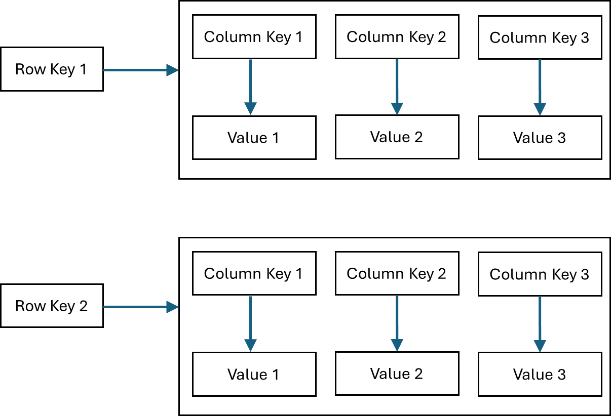

# 01-week

## Compression Algorithms

### Compression Overview

To encode data into a sequence of bits, you can use raw encoding which relies on the data type (boolean, integer, double, character) to map the data item into a sequence of bits of fixed size. This is the raw uncompressed method of encoding. Compression algorithms look for redundancy and repetition in the data values, then re-encode data to reduce the overall number of bits that represent data in storage systems. For example, one way to compress textual data is to map the most frequent characters to codes that use less number of bits than the codes mapped to the less frequent characters. In this way, the total number of bits representing a text could be less than the total number of bits used in raw encoding. 

Compression algorithms utilize more sophisticated mathematical techniques to identify and remove redundancy; they can often realize compression ratios of 10:1 on text data. Note that we’re talking about lossless compression algorithms. Decompressing data encoded with a lossless algorithm recovers a bit-for-bit exact copy of the original data. Lossy compression algorithms for audio, images, and video aim for sensory fidelity; decompression recovers something that sounds like or looks like the original but is not an exact copy. Data engineers might deal with lossy compression algorithms in media processing pipelines but not in serialization for analytics, where exact data fidelity is required.

Traditional compression engines such as gzip and bzip2 compress text data extremely well; they are frequently applied to JSON, XML, CSV, and other text-based data formats. In recent years, engineers have created a new generation of compression algorithms that prioritize speed and CPU efficiency over compression ratio. Major examples are Snappy, Zstandard, LZFSE, and LZ4.

### Compression in Column-Based Formats

Some algorithms are generic and can be used in both row-stores and column-stores to compress data using a general-purpose algorithm: LZO (1996), LZ4 (2011), Snappy (2011), Brotli (2013), Oracle OZIP (2014), and Zstd (2015) - ([source](https://15721.courses.cs.cmu.edu/spring2023/slides/05-compression.pdf)). However, some algorithms are specific to column-stores since they use the fact that consecutive values from the same column are stored together on disk. Compression algorithms benefit from repetition and redundancy in data, and values from the same column can have this characteristic.

Consider the following table:

If data is stored in rows, it means that you need to store the values of product sku, quantity, price, customer id, store ID, and state all together. Since each value represents a different feature, the algorithm might not encounter a lot of repetitions. On the other hand, if data is stored in columns, then the product SKUs are all stored together, same thing for store ID and state. Each column can have lots of repeated values: let’s say you have millions of rows where each row represents an order, then the number of distinct values in the product column will be much less than the total number of rows: maybe 10,000 distinct products.  This column characteristic allows the compression algorithm to detect the common patterns in data easier, as well as represent the data more efficiently. 

In addition to reducing disk space, compression also improves database performance, meaning it helps the database process queries faster since less data is read from disk into memory, and from memory to CPU.

### Examples of Compression Algorithms Used on Column-Based Formats

#### Run-length Encoding

Run-length encoding (RLE) compresses a run of the same values in a column to a more compact representation. Each run is replaced with a tuple that has 3 elements -- (value, start position, runLength), where each element is represented with a fixed number of bits. 

For example, here's the product sku column data from the table mentioned earlier:

34 34 34 63 32 32 32 67 67 67

With RLE, you'll get this result: 

(34, 1, 3), (63, 4, 1,), (32, 5, 3), (67, 8, 3)

RLE can be used in column-oriented systems where the columns have few distinct values, meaning that you'll likely have runs of the same value stored together.

#### Bit-Vector Encoding (or bitmap encoding)

With this algorithm, each distinct value is associated with a sequence of bits where the length of the sequence is the same as the number of records/rows in the column: a ‘1’ in the i-th position means that the distinct value appears in the i-th row of the column, and ‘0’ otherwise.

For example, here's the product sku column data again:

34 34 34 63 32 32 32 67 67 67

With this algorithm, this data would be represented by four sequences of ten bits (i.e. the number of rows):

+ bit-string for value 34: 1110000000
+ bit-string for value 63: 0001000000
+ bit-string for value 32: 0000111000
+ bit-string for value 67: 0000000111

Bit-vector encoding is most useful when columns have a limited number of unique values (such as states in the US, store ID, product ID). However, it can be used even for columns with a large number of distinct values, especially if it is combined with another compression such as RLE (to further compress it).

### Optional Resources

+ Other compression algorithms: [The Design and Implementation of Modern Column-Oriented Database Systems](https://stratos.seas.harvard.edu/files/stratos/files/columnstoresfntdbs.pdf)
+ [Compression encodings supported in AWS](https://docs.aws.amazon.com/redshift/latest/dg/c_Compression_encodings.html)
+ There is an additional file format (Avro) that you may encounter as a data engineer, especially when working with streaming systems such as Kafka. Avro is a row oriented binary file format that encodes semi-structured data in a way that is more efficient than Binary Json. To learn more about Avro, check the following two resources:
  + [Schema evolution](https://martin.kleppmann.com/2012/12/05/schema-evolution-in-avro-protocol-buffers-thrift.html)
  + [Parquet vs Avro](https://airbyte.com/data-engineering-resources/parquet-vs-avro)

## Database Partitioning/Sharding Methods

Let’s take a closer look at one approach for implementing distributed storage, specifically for databases, known as database sharding.

Say you want to distribute the following dataset  across multiple nodes.

| Customer ID | Name   | Country |
|-------------|--------|---------|
| 10023       | Sanjay | IND     |
| 27181       | Jane   | USA     |
| 98221       | Mo     | IND     |
| 10134       | Abdul  | CAN     |
| 33410       | Mina   | USA     |
| 30191       | Sam    | USA     |
| ...         | ...    | ...     |

You need to split the dataset into partitions or shards, where each shard contains unique rows of data and the shards will collectively make up the whole dataset. Then you can distribute these shards across the nodes in your system. You can use a database sharding method or rule to construct a shard key that indicates how the data will be partitioned. 

### Common Sharding Methods

#### Range-based sharding

This method splits the rows based on a range of values. For example, let’s say you want to group the rows based on the first letter of the customer's name. One shard might hold customers whose names start with A through J, another shard might hold names starting with K through R, then a third shard could hold names starting with S through Z. Then the shard key you see in the following tables tells the database which node to distribute each row of data to. This is a straight-forward method but can result in unbalanced shards, meaning unbalanced nodes.

| Name                | Shard Key |
|---------------------|-----------|
| Starts with A to I  | A         |
| Starts with J to S  | B         |
| Starts with T to Z  | C         |

#### Hashed sharding

This method uses a mathematical formula called a hash function to determine how to partition your data. For example, you can simply assign alternating hash values of 1 or 2 to each row to separate the rows into two shards. Then this shard key tells the database where to distribute the data for each row. This method can result in a more even distribution of data across nodes.

#### Geo sharding

This method partitions data based on geographical location. Then you can store the customer's information in nodes that are physically located in that location. By reducing the physical distance between the shard and the customer, you retrieve data faster.

#### Other methods

There are also other methods that split the data based on meaningful attributes, for instance, the customer’s occupation or favorite color.

#### Resources

+ [What is database sharding?](https://aws.amazon.com/what-is/database-sharding/)
+ [Designing data intensive applications](https://www.amazon.com/Designing-Data-Intensive-Applications-Reliable-Maintainable/dp/1449373321/ref=sr_1_1?adgrpid=1344703291324157&dib=eyJ2IjoiMSJ9.i1bUGZK7N-KyWM2sQR7-B8KYS_yn_vgEDIPgCZKZEqrD3_kYv1WLMRNg2a_cyMTZkenScKZLD1xQT6PoxGtZjpfYLwagMBcOcvqwyg12Ux6vvPPHgXX1vMZoOg1vTM_pc7M5GoJOYAWtL-UQU8rix049vlX-qOUnpYLTJ2MrssfiHjzXSj62mtpldPZ9F8sSVwb2QyjkabDuQFUBKt8wljiPffjJIMY5B8rR7JfDvO8.HDmJ7Lu7-7fnydSo4DSG8hxechXwbUNz0baNI01HWH0&dib_tag=se&hvadid=84044027549737&hvbmt=be&hvdev=c&hvlocphy=44152&hvnetw=o&hvqmt=e&hvtargid=kwd-84044312865379%3Aloc-190&hydadcr=16438_10463512&keywords=designing+data+intensive+applications&qid=1713574421&sr=8-1)

## The Parquet Format

### Overview

Column-oriented storage is suitable for analytical workloads that involve aggregating operations to columns. But it is not suitable for reading, writing or updating individual rows. On the other hand, row-oriented storage is more suitable for transactional workloads that require low latency read and write operation, but not efficient analytical workloads.

Parquet and ORC (optimized row columnar) are file formats that combine both column-oriented and row-oriented approaches to harness their strength. In this hybrid approach, rows are partitioned into groups and each row group is stored in a column-wise format.

Although ORC and Parquet are very similar, Parquet has been widely adopted in the modern cloud ecosystem. Historically, ORC gained popularity primarily within the context of Apache Hive, a data warehouse solution. So let’s focus on Parquet.

### A bit more detail about Parquet

A Parquet file horizontally partitions data in to row groups, and each row group typically has a default size of 128MB. Within a row group, each column of the data is assigned to a column chunk, and each column chunk is divided into pages. Each page contains the encoded values for that specific column chunk, metadata (minimum, maximum and count of values) and other data defining the repetition and definition levels that used for reconstructing nested structure of the data. Hence, Parquet can be used for storing tabular data as well as nested data such as JSON file.

Another advantage of Parquet is its portability. So you’ll get better performance with Parquet when interoperating with external tools, unlike proprietary cloud data warehouse columnar formats, that require deserialization and re-serialization for compatibility. 

To learn more about the Parquet format, feel free to check out [this video](https://www.youtube.com/watch?v=1j8SdS7s_NY&t=643s) by Databricks.

### Resources

+ [Parquet, ORC and Avro](https://www.upsolver.com/blog/the-file-format-fundamentals-of-big-data)
+ [Parquet documentation](https://parquet.apache.org/docs/file-format/)

## Wide-Column Databases

A wide-Column database is a type of NoSQL database that's like a combination of a relational database and a document store. It structures the value part of a key-value pair into more key-value pairs.

In a key-value database, the data is represented as follows:

On the other hand, a wide-column database stores data in tables that are like two-dimensional key-value maps:

Each row usually describes a single entity, and is identified by its row key. Within a row, data that’s related is modeled into column families that contain columns with unique column names. The actual data is stored within cells, which are uniquely identified by the combination of row key, column family, and column name (e.g. row key 1, column family 4, column key 3).  

For example, let’s suppose you want to store customer and purchase information in a wide-column database like this:

You could use the customer_id 12345 as the row key that points to two column families -- customer information with 3 columns (first_name, last_name, and phone_num) and purchase information with 2 columns (invoice_num and store_id). 

Each cell value is versioned and uniquely identified by its version number, typically its timestamp. Let’s say this customer changed their phone number or made more than one purchase, then these cells will contain multiple values, each identified by their timestamp. 

Now, let’s say you have another customer, with customer_id 45678, who you don’t know the phone number for and who hasn’t made any purchases. Then their row key will point to the customer information column family that contains only the customer’s first_name and last_name columns without the phone_num column. Since this customer hasn’t made any purchases, you don’t have to point to a purchase information column family. When this information becomes available, you can add that to the wide-column database. Since the wide-column database doesn’t enforce a strict table schema, adding columns becomes very flexible, and a column is only written if there’s data for it. 

A wide-column database typically stores column families separately on disk. So it will store the customer information separately from the purchase information. Then the data within a column family is stored in a row-oriented fashion. So, for the purchase information, you would store all the data for a specific row key next to each other on disk, storing all the invoice_num values together, then the store_id values together, before moving on to the next row key, and so on.

Examples of wide-column databases include [HBase](https://databass.dev/links/118), [BigTable](https://databass.dev/links/117), [Apache Cassandra](https://cassandra.apache.org/_/index.html), and [Amazon keyspaces](https://aws.amazon.com/keyspaces/) (for Apache Cassandra)

### Resources

+ [Wide-column Databases](https://scaleyourapp.com/wide-column-and-column-oriented-databases/)
+ [Cassandra: The Definitive Guid](https://www.amazon.com/Cassandra-Definitive-Guide-Distributed-Scale/dp/1491933666)
+ [Introduction to HBase schema desig](http://0b4af6cdc2f0c5998459-c0245c5c937c5dedcca3f1764ecc9b2f.r43.cf2.rackcdn.com/9353-login1210_khurana.pdf)
+ [Apache Cassandra VS Apache HBase](https://aws.amazon.com/compare/the-difference-between-cassandra-and-hbase/)

## ANN Algorithm: Hierarchical Navigable Small World (HNSW)

Hierarchical Navigable Small World (HNSW) is a popular ANN algorithm that underpins many vector databases and is considered to be among the best performing ANN algorithms.

This algorithm relies on building a hierarchical graph representation of the embeddings: each layer consists of a graph representation of the data, where each node represents an embedding, and each edge represents the degree of similarity between two nodes. The layers are constructed in a way so that the top layer contains more of the longest links and the bottom layer contains more of the shortest links. Moreover as you move up from the lowest layers to the highest layer, the number of nodes decreases. 

Given a query point (e.g. the green node in the image above), the algorithm starts at the entry node of the top layer (i.e. the red node) and navigates through the graph of that layer, each time choosing the neighboring node that is closest to the query point. It stops at the node that does not have any neighboring nodes closer to the query point. At this point, the algorithm shifts to the current node in the next lower layer and begins searching again. It repeats the process until it finds the nearest node at the bottom layer.

The way this algorithm organizes the data reduces the time and computational resources needed for these searches when compared to the k-nearest neighbors algorithm.

### Resources

+ [What is similarity search?](https://www.pinecone.io/learn/what-is-similarity-search/)
+ [Use cases of similarity search](https://hyper-space.hashnode.dev/what-is-similarity-search-definition-and-use-cases)
+ [What is a vector database?](https://www.pinecone.io/learn/vector-database/)
+ [HNSW](https://www.pinecone.io/learn/series/faiss/hnsw/)
+ [Efficient and robust approximate nearest neighbor search using Hierarchical Navigable Small World graphs](https://arxiv.org/pdf/1603.09320.pdf)
